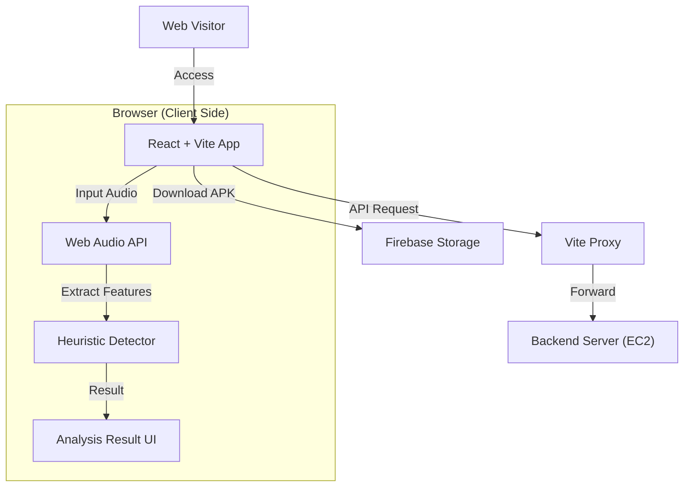

# 🛡️ DeepVoice Shield - Landing Page

> **Service Introduction & Web Demo** > 온디바이스 딥보이스 탐지 앱을 소개하고, 웹에서 간단한 체험을 제공하는 반응형 웹사이트


## 📌 Project Overview
**DeepVoice Shield Landing Page**는 모바일 앱의 기능을 시각적으로 소개하고, 사용자에게 설치 파일(APK)을 배포하는 웹 프론트엔드 프로젝트입니다.

단순한 소개 페이지를 넘어, **Web Audio API**를 활용한 **클라이언트 사이드 데모(Heuristic Demo)** 기능을 포함하여 사용자가 앱 설치 전 기본적인 음성 분석 과정을 체험해 볼 수 있습니다.

## 🌟 Key Features

### 1. 🎨 Interactive UI/UX
- **Scroll-driven Animations**: 스크롤에 반응하는 스마트폰 목업 및 화면 전환 효과 구현.
- **Responsive Design**: 데스크톱, 태블릿, 모바일에 최적화된 반응형 레이아웃.
- **Glassmorphism**: 모던한 블러(Blur) 효과와 그라디언트 디자인 적용.

### 2. 🧪 Web Audio Demo
- **Client-side Analysis**: 서버 업로드 없이 브라우저 내에서 오디오 파일을 디코딩 및 분석.
- **Heuristic Detection**: RMS(에너지), ZCR(제로 크로싱), 무성음 비율 등을 분석하여 가짜 음성 의심 여부를 시뮬레이션.

### 3. 📦 App Distribution
- **Direct Download**: Firebase Storage에 호스팅된 최신 APK 파일 다운로드 링크 제공.
- **QR Code Modal**: PC 사용자를 위한 모바일 설치용 QR 코드 제공.

## 🚀 System Architecture



## 🛠️ Tech Stack

| Category | Technology | Description |
| :--- | :--- | :--- |
| **Framework** | React 18 | Component-based UI Library |
| **Build Tool** | Vite 5 | Fast development server & bundler |
| **Styling** | Native CSS | CSS Variables & Media Queries (No external UI lib) |
| **Audio Processing** | Web Audio API | Client-side audio decoding & analysis |
| **Network** | Axios | HTTP Client (w/ Interceptors) |
| **Deployment** | Vercel / Netlify | Static Site Hosting (Recommended) |

## 📂 Directory Structure

```
frontend/
├── public/             # Static Assets (Images, QR codes)
├── src/
│   ├── lib/
│   │   ├── config.js       # API & Axios Configuration
│   │   └── demoDetector.js # [Core] Web Audio Analysis Logic
│   ├── App.jsx         # Main Landing Page Component
│   ├── main.jsx        # Entry Point
│   └── styles.css      # Global Styles & Animations
├── index.html          # HTML Template
├── vite.config.js      # Vite Configuration (Proxy setup)
└── package.json        # Dependencies
```

## 🚀 Getting Started

### Prerequisites
- **Node.js** >= 18
- **NPM** or **Yarn**

### 1. Installation
```bash
# Clone the repository
git clone [https://github.com/thisNorm/deepfake_detection_service_frontend.git](https://github.com/thisNorm/deepfake_detection_service_frontend.git)
cd deepfake_detection_service_frontend

# Install dependencies
npm install
```

### 2. Environment Setup
필요한 경우 `.env` 파일을 생성하여 백엔드 주소를 설정할 수 있습니다. (기본값은 `lib/config.js`에 포함되어 있습니다.)

```bash
# .env (Optional)
VITE_API_BASE=http://your-backend-url:3000
```

### 3. Run Development Server
```bash
npm run dev
# Running at http://localhost:5173
```

### 4. Build for Production
```bash
npm run build
# Output directory: dist/
```

## 🧪 Demo Logic (`demoDetector.js`)
웹 데모는 실제 딥러닝 모델(.ptl)을 사용하지 않고, 브라우저 환경에 맞춘 **경량화된 휴리스틱 알고리즘**을 사용합니다.

1. **Decode**: 업로드된 오디오 파일을 `AudioContext`로 디코딩.
2. **Resample**: 16kHz Mono로 변환.
3. **Feature Extraction**:
   - **RMS (Root Mean Square)**: 소리 에너지의 일관성 확인.
   - **ZCR (Zero Crossing Rate)**: 주파수 변동성 확인.
   - **Silence Ratio**: 무성음 구간 비율 확인.
4. **Scoring**: 위 특징들이 자연스러운 사람의 목소리 패턴(변동성 있음)과 다를 경우, '가짜' 확률을 높게 산정.

## 🔗 Related Repositories
+ Backend: [deepfake_detection_service_backend](https://github.com/thisNorm/deepfake_detection_service_backend.git)

+ Frontend (Landing): [deepfake_detection_service_frontend](https://github.com/thisNorm/deepfake_detection_service_frontend.git)

+ Algorithm: [deepfake_detection_service_algorithm](https://github.com/thisNorm/deepfake_detection_service_algorithm.git)
